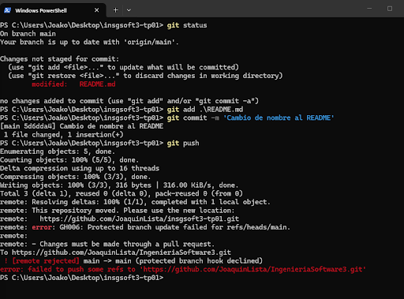
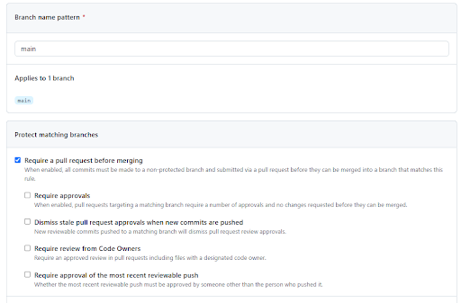
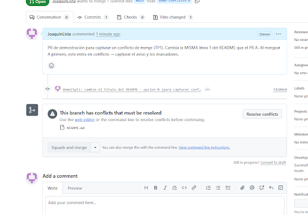
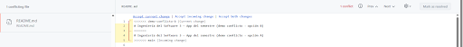
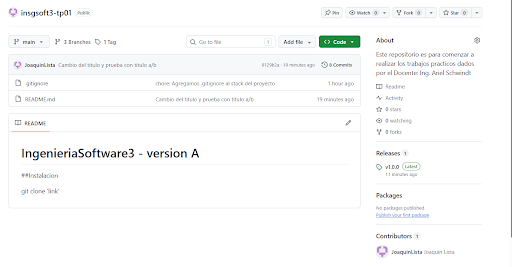
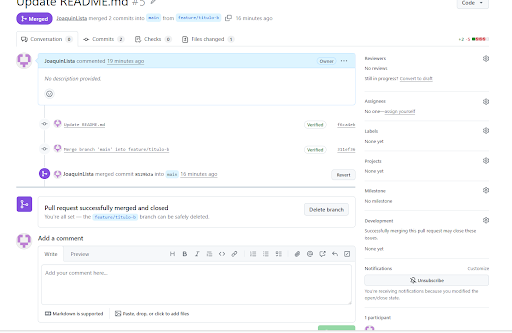
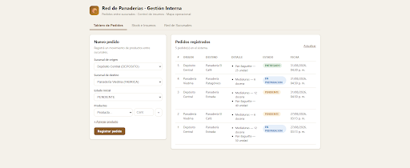
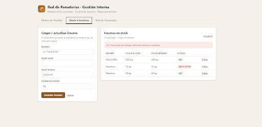
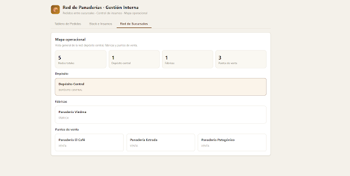
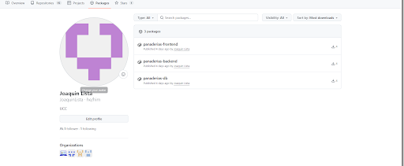

# Evidencias

Documento acumulativo. Cada TP agrega su sección con salidas de comandos y capturas.

> Las salidas de abajo son reales, tomadas en una corrida limpia. Para la defensa
> conviene además agregar capturas de pantalla del navegador (carpeta `evidencias/`).

---

## TP1 — Git colaborativo

El enunciado pide **cuatro capturas**: (1) push directo rechazado, (2) aviso de conflicto
en el PR, (3) marcadores del conflicto, (4) release publicada.

### 1. Push directo a `main` rechazado



```
! [remote rejected] main -> main (protected branch hook declined)
remote: error: GH006: Protected branch update failed for refs/heads/main.
remote: Changes must be made through a pull request.
```

La protección de rama (con *Include administrators* activado) impide el push directo. El
cambio tuvo que entrar por una rama + Pull Request.

### 2. Configuración de la protección de rama



*Require a pull request before merging* activado, sobre el patrón `main`.

### 3. Aviso de conflicto en el Pull Request



GitHub muestra *"This branch has conflicts that must be resolved"* con `README.md` listado y
el botón **Resolve conflicts**.

> **Nota honesta:** el conflicto original del TP1 (`feature/titulo-a` vs `feature/titulo-b`,
> PR #5, ago-2026) se resolvió en su momento pero **no se capturó la pantalla**. Para tener
> la evidencia que pide el enunciado se **recreó** un conflicto idéntico: dos ramas
> (`demo-conflicto-a` / `demo-conflicto-b`) cambian la misma línea 1 del README; al mergear
> una, la otra entra en conflicto. El conflicto original sigue registrado en el historial en
> el merge commit `311ef36`:
>
> ```
> $ git show 311ef36
>   Merge branch 'main' into feature/titulo-b
>   diff --cc README.md
>   @@@ -1,9 -1,9 +1,6 @@@
>   - # IngenieriaSoftware3 - version B      (traía feature/titulo-b)
>   + # IngenieriaSoftware3 - version A      (ya estaba en main, vía PR #4)
> ```

### 4. Marcadores del conflicto (`<<<<<<<`)



El editor de conflictos de GitHub muestra el choque con `<<<<<<< demo-conflicto-b` /
`=======` / `>>>>>>> main` sobre la línea del título. Git no puede elegir entre las dos
versiones porque ambas ramas modificaron **la misma línea** partiendo del mismo ancestro
(ver `decisiones.md` §TP1.3). La resolución deja una sola línea con el título correcto.

### 5. Release publicada



Tag anotado `v1.0.0` + release, en la página del repositorio. Versionado semántico
(ver `decisiones.md` §TP1.4).

### 6. Pull Request mergeado (apoyo)



PR #5 (`feature/titulo-b`) mergeado a `main` — incluye el commit de resolución del conflicto.

---

## TP2 — Contenedores

### 1. `docker compose up -d --build` desde cero

```
$ docker compose up -d --build
 Image ghcr.io/joaquinlista/panaderias-db:v0.1.0 Built
 Image ghcr.io/joaquinlista/panaderias-backend:v0.1.0 Built
 Image ghcr.io/joaquinlista/panaderias-frontend:v0.1.0 Built
 Network insgsoft3-tp01_panaderias_net  Created
 Volume "insgsoft3-tp01_postgres_data"  Created
 Container panaderias_db        Started
 Container panaderias_db        Waiting
 Container panaderias_db        Healthy
 Container panaderias_backend   Started
 Container panaderias_backend   Waiting
 Container panaderias_backend   Healthy
 Container panaderias_frontend  Started
```

```
$ docker compose ps
NAME                  IMAGE                                            SERVICE   STATUS
panaderias_backend    ghcr.io/joaquinlista/panaderias-backend:v0.1.0   backend   Up (healthy)   0.0.0.0:3000->3000/tcp
panaderias_db         ghcr.io/joaquinlista/panaderias-db:v0.1.0        db        Up (healthy)   5432/tcp
panaderias_frontend   ghcr.io/joaquinlista/panaderias-frontend:v0.1.0  frontend  Up             0.0.0.0:80->80/tcp
```

### 2. Sistema funcionando end-to-end (navegador → nginx → backend → db)

```
$ curl -s http://localhost/api/health
{"status":"ok","db":"up","timestamp":"2026-08-27T18:11:06.425Z"}

$ curl -s http://localhost/api/sucursales
[{"id":5,"nombre":"Depósito Central","tipo":"DEPOSITO"},
 {"id":1,"nombre":"Panadería Viedma","tipo":"FABRICA"},
 {"id":4,"nombre":"Panadería El Café","tipo":"VENTA"},
 {"id":2,"nombre":"Panadería Estrada","tipo":"VENTA"},
 {"id":3,"nombre":"Panadería Patagónico","tipo":"VENTA"}]

# Alta de pedido (transaccional: cabecera + detalle)
$ curl -s -X POST http://localhost/api/pedidos -H 'Content-Type: application/json' \
    -d '{"sucursal_origen_id":5,"sucursal_destino_id":2,"detalles":[{"producto_id":1,"cantidad":12}]}'
{"id":1,"estado":"PENDIENTE","fecha_creacion":"2026-08-27T18:11:06.597Z",
 "sucursal_origen_nombre":"Depósito Central","sucursal_destino_nombre":"Panadería Estrada",
 "detalles":[{"id":1,"producto_id":1,"cantidad":"12.00","producto_nombre":"Medialunas","producto_unidad":"docena"}]}

$ curl -s -o /dev/null -w "%{http_code}\n" http://localhost/
200
```

La llamada entra por `http://localhost/api/...` (puerto 80, nginx), nginx la
reenvía a `http://backend:3000` por la red interna, y el backend consulta `db`.
El navegador nunca ve el puerto 3000.

Capturas del navegador en `http://localhost` (stack levantado con `docker compose up -d`):

| Pestaña | Archivo |
|---|---|
| Tablero de Pedidos |  |
| Stock e Insumos |  |
| Red de Sucursales |  |

### 3. Prueba de persistencia

```
# Hay 1 pedido cargado.
$ docker compose down          # apaga; NO borra el volumen
$ docker compose up -d
$ curl -s http://localhost/api/pedidos
[{"id":1,"estado":"PENDIENTE","fecha_creacion":"2026-08-27T18:11:06.597Z", ...}]
                                                  ^ SIGUE: el volumen sobrevivió

$ docker compose down -v       # apaga Y borra el volumen postgres_data
 Volume insgsoft3-tp01_postgres_data  Removed
$ docker compose up -d
$ curl -s http://localhost/api/pedidos
[]                                                ^ VACÍO: -v se llevó los datos
```

`down` apaga; `down -v` además olvida.

### 4. Tamaño: imagen final vs imagen de build

```
$ docker images
REPOSITORY                                 TAG         SIZE
node:22-alpine                             -           232MB     (base de build)
ghcr.io/joaquinlista/panaderias-backend    v0.1.0      239MB     (final: base + deps prod + src)
panaderias-frontend  (etapa build)         -           314MB     (node + node_modules + fuente)
ghcr.io/joaquinlista/panaderias-frontend   v0.1.0       73.9MB   (final: nginx:alpine + dist/)
ghcr.io/joaquinlista/panaderias-db         v0.1.0      416MB     (postgres:15-alpine + init.sql)
```

- **Frontend:** la etapa de build pesa **314 MB**; la imagen final **73.9 MB**
  (−76%). Node y `node_modules` no viajan a producción — la sirve nginx.
- **Backend:** el multi-stage no achica tanto (el runtime necesita Node igual),
  pero la etapa `deps` usa `npm ci --omit=dev`: no viajan devDependencies, cache
  de npm ni herramientas de build.

### 5. Imágenes publicadas en el registry

Las tres imágenes en `ghcr.io/joaquinlista/*`, tag `v0.1.0`, visibilidad **pública**
(`github.com/JoaquinLista?tab=packages`):

```
$ docker compose push
 ghcr.io/joaquinlista/panaderias-db:v0.1.0        Pushed
 ghcr.io/joaquinlista/panaderias-backend:v0.1.0   Pushed
 ghcr.io/joaquinlista/panaderias-frontend:v0.1.0  Pushed
```

Digests publicados:

```
ghcr.io/joaquinlista/panaderias-db:v0.1.0        sha256:d6a47b38866b20aa2173889787231dc43586d0501f9cb53c4968f39565f7e821
ghcr.io/joaquinlista/panaderias-backend:v0.1.0   sha256:e966ade863778afa8176ad2516563a7a1437ff09a50a3f6f21f3408f984caef9
ghcr.io/joaquinlista/panaderias-frontend:v0.1.0  sha256:5995d84e09058ed1381c134d7573ec45950dc4a1f1f713d008b23536bc89638a
```

**Checkpoint del enunciado — levantar sin credenciales y sin el código:**

```
$ docker compose down
$ docker rmi ghcr.io/joaquinlista/panaderias-{db,backend,frontend}:v0.1.0   # borra las locales
$ docker logout ghcr.io                                                      # sin sesión

$ docker compose -f docker-compose.registry.yml pull
 Image ghcr.io/joaquinlista/panaderias-backend:v0.1.0   Pulled
 Image ghcr.io/joaquinlista/panaderias-frontend:v0.1.0  Pulled
 Image ghcr.io/joaquinlista/panaderias-db:v0.1.0        Pulled

$ docker compose -f docker-compose.registry.yml up -d
$ docker compose -f docker-compose.registry.yml ps
NAME                  IMAGE                                            STATUS
panaderias_backend    ghcr.io/joaquinlista/panaderias-backend:v0.1.0   Up (healthy)
panaderias_db         ghcr.io/joaquinlista/panaderias-db:v0.1.0        Up (healthy)
panaderias_frontend   ghcr.io/joaquinlista/panaderias-frontend:v0.1.0  Up

$ curl -s http://localhost/api/health
{"status":"ok","db":"up","timestamp":"2026-08-27T18:35:33.444Z"}
```

Descargó las imágenes públicas estando deslogueado y el sistema quedó funcionando
end-to-end.



> Nota de arquitectura: las imágenes se construyeron en una PC Intel/AMD (linux/amd64).
> Multi-arch se resuelve en el TP7 con `docker buildx`.

---

## TP4 — CI: el pipeline como gate del PR

El enunciado del TP4 no pide capturas (las corridas del pipeline son públicas y
permanentes en la pestaña *Actions*). Esta sección las agrega igual porque la parte que
**no** queda registrada sola es el momento en que el pipeline bloquea un merge.

Todo el detalle de decisiones está en [`decisiones.md`](decisiones.md) §TP4.

### 1. El pipeline corriendo en cada PR

Dos jobs en paralelo, `build-backend` y `build-frontend`, construyendo las imágenes de la
app con los Dockerfiles del TP2 (`docker/build-push-action` con `push: false`).

Corridas públicas: pestaña [*Actions*](https://github.com/JoaquinLista/insgsoft3-tp01/actions/workflows/ci.yml)
del repo.

### 2. Demostración del gate — el pipeline en rojo bloquea el merge

[PR #27](https://github.com/JoaquinLista/insgsoft3-tp01/pull/27) (rama `demo/rompe-el-build`).
Se agregó a propósito un `import` a un archivo inexistente en `frontend/src/main.jsx`.

**Corrida en rojo** — [run 33581643871](https://github.com/JoaquinLista/insgsoft3-tp01/actions/runs/33581643871):

```
build-frontend   fail   Could not resolve "./modulo-inexistente.js" from "src/main.jsx"
                        process "/bin/sh -c npm run build" did not complete successfully: exit code: 1
                        ERROR: buildx failed
build-backend    pass   (mismo commit — los dos jobs son independientes)
```

Con `build-frontend` en rojo, GitHub marcó el PR como `BLOCKED` y deshabilitó el botón de
merge.


### 3. El fix — pipeline en verde, merge habilitado

Un segundo commit sacó el `import`. El pipeline volvió a correr solo sobre la mezcla con
`main` y los dos checks pasaron a verde — [run 33582057303](https://github.com/JoaquinLista/insgsoft3-tp01/actions/runs/33582057303).
El PR pasó a `CLEAN` y se pudo mergear (squash, commit `63af595`). En el PR #27 ya mergeado
se ven las dos corridas (la roja del primer commit y la verde del segundo) en la pestaña
*Checks*.

### 4. Configuración del gate

Settings → Branches → regla de `main`: *Require status checks to pass before merging* con
`build-backend` y `build-frontend`, más *Require branches to be up to date before merging*
(`strict: true`). Se suma a la protección de rama del TP1 (PR obligatorio, *Include
administrators*), que quedó intacta.


