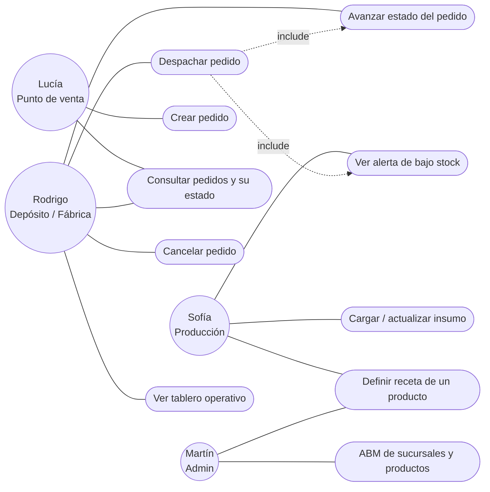

# Épicas

Grandes líneas de trabajo. Cada una agrupa varias historias de usuario y se cruza con
el TP donde su parte técnica aterriza.

| ID | Épica | Estado en el código | Aterriza en |
|----|-------|---------------------|-------------|
| E1 | Gestión de pedidos entre sucursales | Implementada (alta + listado) | TP5 (tests), TP6 (e2e) |
| E2 | Ciclo de vida del pedido (máquina de estados) | **No implementada** | TP3/TP5 |
| E3 | Control de stock de insumos | Implementada (upsert + alerta) | TP5 (tests) |
| E4 | Consumo de insumos al despachar (recetas) | **No implementada** (falta modelar receta) | TP3/TP5 |
| E5 | Gestión de catálogo (sucursales y productos) | Parcial (solo por seed) | TP5 |
| E6 | Visibilidad operativa (tableros y métricas) | Parcial (contadores en las vistas) | TP6, TP8 |

---

## Mapa de casos de uso

Vista única de qué hace cada rol. Los óvalos son casos de uso; las líneas punteadas
`«include»` marcan funcionalidad obligatoria que un caso de uso reutiliza de otro.



| Caso de uso | Épica | Historia |
|---|---|---|
| Crear pedido | E1 | HU-01 |
| Consultar pedidos y su estado | E1 / E6 | HU-02, HU-03, HU-15 |
| Avanzar estado del pedido | E2 | HU-08, HU-10 |
| Cancelar pedido | E2 | HU-09 |
| Despachar pedido (descuenta insumos) | E4 | HU-11, HU-12 |
| Cargar / actualizar insumo | E3 | HU-04, HU-06 |
| Ver alerta de bajo stock | E3 | HU-05 |
| Definir receta de un producto | E4 | HU-07 |
| ABM de sucursales y productos | E5 | HU-13, HU-14 |
| Ver tablero operativo | E6 | HU-16 |

---

## E1 — Gestión de pedidos entre sucursales

**Objetivo:** que cualquier encargado pueda registrar un pedido de productos de una
sucursal a otra y consultarlo después, sin usar WhatsApp.

Incluye: alta de pedido con detalle multi-ítem, validación de origen ≠ destino y
cantidades > 0, listado con detalle, transaccionalidad del alta.

Historias: `HU-01` (crear pedido), `HU-02` (listar pedidos), `HU-03` (ver detalle de un pedido).

---

## E2 — Ciclo de vida del pedido

**Objetivo:** que un pedido avance por estados de forma controlada, sin saltear pasos ni
retroceder, para que depósito y locales vean siempre la misma realidad.

Máquina de estados:

```
PENDIENTE ──▶ EN_PREPARACION ──▶ DESPACHADO ──▶ ENTREGADO
    │                │
    └────────────────┴──▶ CANCELADO   (solo antes de DESPACHADO)
```

Transiciones válidas: avanzar de a un paso, o cancelar mientras el pedido no salió del
depósito. Todo lo demás se rechaza. `ENTREGADO` y `CANCELADO` son finales.

> Nota: `CANCELADO` es un estado nuevo respecto del schema actual; agregarlo es parte de
> esta épica.

Historias: `HU-08` (avanzar estado), `HU-09` (cancelar pedido), `HU-10` (rechazo de
transición inválida).

---

## E3 — Control de stock de insumos

**Objetivo:** que Sofía mantenga el stock de insumos al día y el sistema le avise antes
de un quiebre.

Incluye: alta/edición de insumo (upsert por nombre), definición de stock mínimo, flag y
alerta visual de *bajo stock*, listado ordenado.

Historias: `HU-04` (alta/edición de insumo), `HU-05` (alerta de bajo stock),
`HU-06` (validación de stock no negativo).

---

## E4 — Consumo de insumos al despachar

**Objetivo:** que despachar un pedido descuente automáticamente los insumos que
consumen los productos de ese pedido, y que no se pueda despachar si no alcanza el stock.

Requiere modelar la **receta** (producto → insumos + cantidades). Al pasar un pedido a
`DESPACHADO`:

1. Se calcula el consumo total de cada insumo sumando `cantidad_producto × receta`.
2. Si algún insumo no alcanza, la transición se rechaza y no se descuenta nada.
3. Si alcanza, se descuenta en una sola transacción junto con el cambio de estado.

Historias: `HU-07` (definir receta de un producto), `HU-11` (descuento de insumos al
despachar), `HU-12` (rechazo por stock insuficiente).

---

## E5 — Gestión de catálogo

**Objetivo:** que un admin cargue y edite sucursales y productos desde la app, no desde
el `init.sql`.

Incluye: ABM de sucursales (con validación de tipo), ABM de productos, no permitir
borrar algo referenciado por un pedido.

Historias: `HU-13` (ABM sucursales), `HU-14` (ABM productos).

---

## E6 — Visibilidad operativa

**Objetivo:** que cada rol tenga un tablero con lo que necesita ver de un vistazo.

Incluye: filtro de pedidos por estado, contadores por estado, mapa de la red (ya
existe), y — más adelante, TP8 — métricas de observabilidad.

Historias: `HU-15` (filtrar pedidos por estado), `HU-16` (tablero de pendientes del
depósito).
