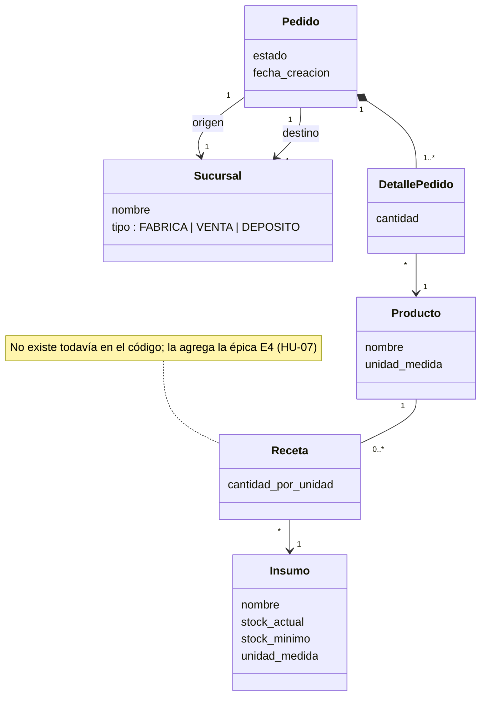

# Glosario (lenguaje ubicuo)

Un término, una definición. Estos nombres se usan igual en las historias, en la UI, en
la API y en las tablas de la base.

| Término | Definición | Dónde vive hoy |
|---|---|---|
| **Sucursal** | Nodo físico de la red. Tiene un `tipo`: `FABRICA`, `VENTA` o `DEPOSITO`. | tabla `sucursales` |
| **Fábrica** | Sucursal que produce. En la red actual es una sola (Panadería Viedma). | `sucursales.tipo = 'FABRICA'` |
| **Depósito** | Sucursal que almacena y distribuye. Una sola (Depósito Central). | `sucursales.tipo = 'DEPOSITO'` |
| **Punto de venta** | Sucursal que vende al público y pide reposición. Hay tres. | `sucursales.tipo = 'VENTA'` |
| **Producto** | Bien terminado que se mueve entre sucursales (medialunas, baguette). Se mide en una `unidad_medida` (docena, unidad). | tabla `productos` |
| **Insumo** | Materia prima que consume la producción (harina, levadura, manteca). Tiene `stock_actual` y `stock_minimo`. | tabla `insumos` |
| **Receta** | Lista de insumos y cantidades que consume **una unidad** de un producto. *(No modelada todavía — la agrega E4.)* | *pendiente* |
| **Pedido** | Solicitud de movimiento de productos desde una `sucursal_origen` hacia una `sucursal_destino`. Tiene un `estado` y una `fecha_creacion`. | tabla `pedidos` |
| **Detalle de pedido** | Cada línea de un pedido: un producto y una cantidad (> 0). | tabla `detalles_pedido` |
| **Estado del pedido** | Punto del ciclo de vida: `PENDIENTE`, `EN_PREPARACION`, `DESPACHADO`, `ENTREGADO`. | `pedidos.estado` |
| **Transición** | Cambio de un estado a otro. Solo algunas son válidas (ver E2). | *lógica pendiente* |
| **Despachar** | Transición `EN_PREPARACION → DESPACHADO`. Es el momento en que se descuenta el stock de insumos (E4). | *lógica pendiente* |
| **Bajo stock** | Condición de un insumo cuyo `stock_actual < stock_minimo`. El sistema lo marca visualmente. | calculado en `insumosService.js` |
| **Stock mínimo** | Umbral por debajo del cual un insumo se considera *bajo stock*. Lo define Sofía. | `insumos.stock_minimo` |
| **Upsert de insumo** | Alta o actualización de un insumo identificándolo por `nombre` (no por id). | `insumosService.guardarInsumo` |
| **Mapa operacional / Red de sucursales** | Vista de solo lectura que agrupa las sucursales por tipo. | pestaña "Red de Sucursales" |

## Modelo de dominio

Cómo se relacionan los términos de arriba. Es un modelo **conceptual** (del problema), no
el esquema de la base: los atributos son los que importan para el negocio.

Lecturas clave:
- Un **pedido** tiene origen y destino distintos (dos vínculos a `Sucursal`) y al menos un
  **detalle**; si se borra el pedido, se borran sus detalles (composición).
- La **receta** es lo que une el mundo de los productos con el de los insumos: sin receta,
  despachar un producto no consume nada.

## Convenciones

- En **código y API**: `EN_PREPARACION` (mayúsculas, guion bajo, sin tilde).
- En **UI y textos para el usuario**: "En preparación".
- Las historias se escriben con la forma UI ("En preparación") y aclaran el valor
  técnico cuando hace falta.
